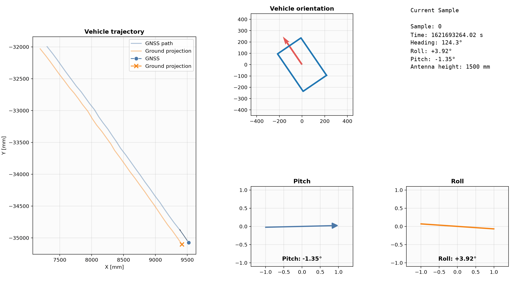

# Vehicle Ground Projection and Heading Estimation

## Overview

This project solves the following tasks:

1. Calculate the projection of a GNSS antenna mounted **1500 mm above the vehicle moving plane** onto the moving plane.
2. Estimate the vehicle heading from GNSS position measurements, assuming smooth forward motion.
3. Visualize the computed results using static plots and an animated GIF.

The solution is implemented in **Python 3** with a modular design that separates data loading, mathematical computations and visualization.

---

## Input Data

The input dataset consists of the following values:

| Field       | Description         | Unit |
| ----------- | ------------------- | ---- |
| `time_s`    | Timestamp           | s    |
| `x_mm`      | GNSS X coordinate   | mm   |
| `y_mm`      | GNSS Y coordinate   | mm   |
| `roll_deg`  | Vehicle roll angle  | °    |
| `pitch_deg` | Vehicle pitch angle | °    |

The GNSS antenna is mounted **1500 mm above the moving plane**.

The task defines the following angle conventions:

- **Positive roll** → the **right side** of the vehicle is lower than the left side.
- **Positive pitch** → the **front** of the vehicle is lower than the rear.

---

# Solution

## 1. Data Loading

The input data is loaded using **Pandas**.

Before any calculations, roll and pitch are converted from degrees to radians because NumPy trigonometric functions expect radians.

```text
angle_rad = angle_deg × π / 180
```

---

## 2. Vehicle Heading Estimation

The dataset does not contain the vehicle heading directly.

Since the task specifies that the vehicle moves smoothly forward, the heading can be estimated from consecutive GNSS positions.

The position differences are calculated as

```text
Δx = x(i+1) - x(i)
Δy = y(i+1) - y(i)
```

The heading angle is then computed using

```text
heading = atan2(Δy, Δx)
```

Using `atan2()` correctly determines the angle in all four quadrants and avoids ambiguity that would occur with `atan()`.

---

## 3. Ground Projection

The GNSS antenna is located **1500 mm above the moving plane**.

If the vehicle had zero roll and pitch, the antenna projection would lie directly below the antenna.

When the vehicle is tilted, the antenna position is horizontally displaced.

The local offsets are computed as

```text
offset_forward = height × sin(pitch)

offset_right = -height × sin(roll)
```

where

- `height = 1500 mm`

These offsets are expressed in the **vehicle coordinate system**.

Because the vehicle is moving in an arbitrary direction, the local offset must be rotated into the global XY coordinate system using the estimated heading.

The rotation is

```text
ΔX = offset_forward × cos(heading)
     - offset_right × sin(heading)

ΔY = offset_forward × sin(heading)
     + offset_right × cos(heading)
```

Finally,

```text
ground_x = gnss_x + ΔX
ground_y = gnss_y + ΔY
```

This produces the projected position of the antenna on the moving plane.

---

# Output

The vehicle heading estimation and ground projection calculations for each time unit are stored back to pandas dataframe and stored in `output/solution.csv`.

Besides the calculated values here is also an animated figure that I believe shows the best what is going on.


